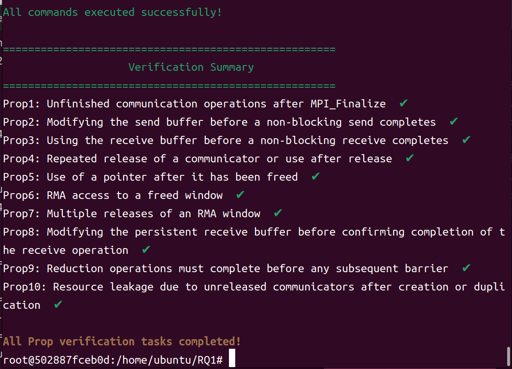
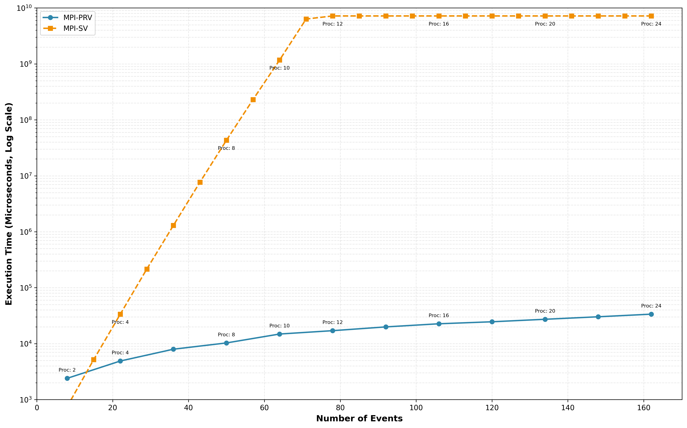
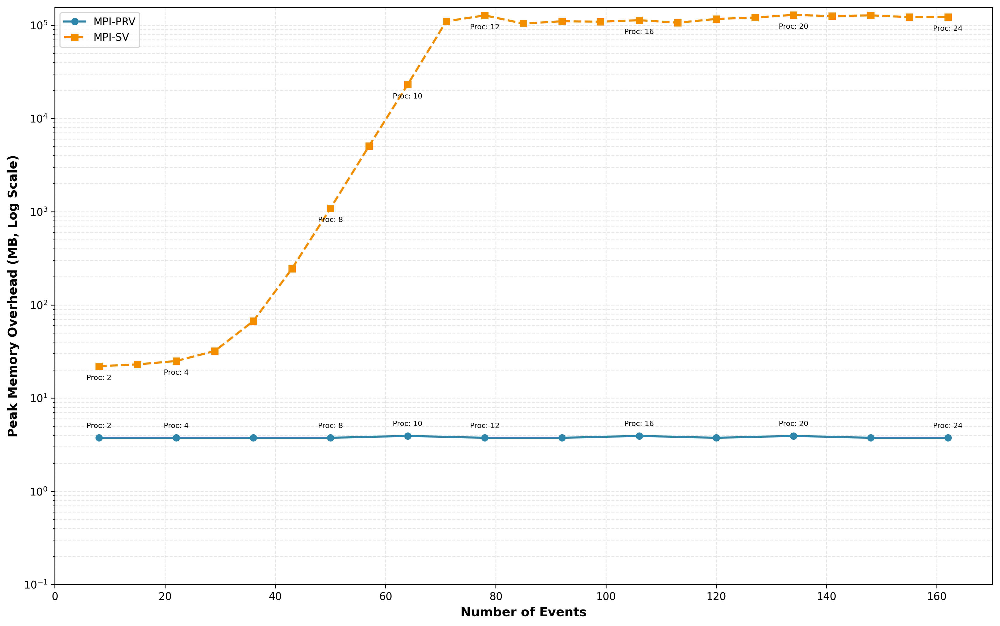
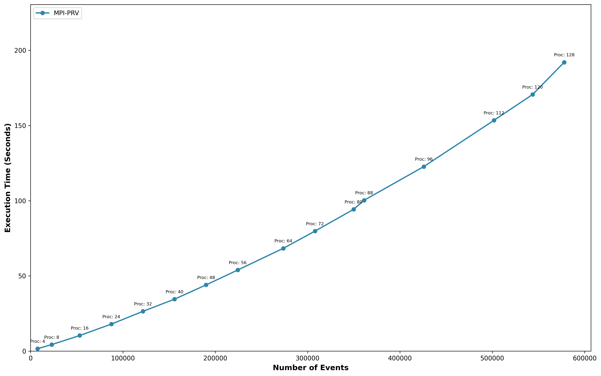
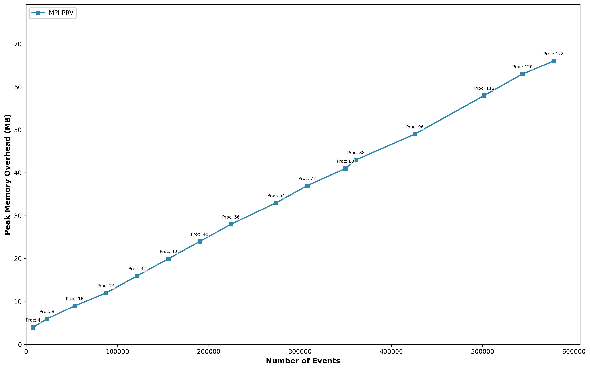

# MPI-PRV
## Artifact description
This is the artifact of (**Efficient Predictive Monitoring of Message Passing Interface Programs**) in  ISSTA2026. 

The artifact is provided as a docker image, which contains the prototype of the proposed method and benchmarks used for evaluation. The aim is to assist the reviewers in reproducing the experimental results in our evaluation.

## Prerequisites
+ Hardware: ~3.1 GHz CPU (all experiments were performed on a server with Intel(R) Xeon(R) Gold 6458Q CPU @ 3.10GHz, 128 Cores, 500GB), 500+GB free disk space.
+ Unix / Linux OS: We have validated the artifact on Ubuntu system
+ [Docker](https://www.docker.com/pricing/)

## Running the artifact
We assume that the following commands are run in sudo mode. 

Firstly, pull the already prebuilt docker image from [docker hub](https://hub.docker.com/repository/docker/mpiprv/mpiprv). Please make sure its name is `mpiprv/mpiprv`.
```sh
$ docker pull mpiprv/mpiprv:latest
```

If everything is ok, a `mpiprv/mpiprv` image should be found in the images listed by `docker images` command. Then, you can create a container of such image and start a Bash session using the following command. An interactive `bash` shell on the container is also executed at the moment.
```sh
$ docker run  --privileged -it mpiprv/mpiprv:latest
```

If all goes well, the container should be running successfully. Otherwise, you can seek help from [Docker Doc](https://docs.docker.com/) if needed. 

Now, navigate into the directory containing our experimental environment and list the contents. 
```sh
$ cd /home/ubuntu/ && ls
Example / LLVM / MPI-PRV / MPI-SV / MUST-v1.9.0 / RQ1 / RQ2 / RQ4 / TranMPI-SV / tools

$ cd /home/ubuntu/MPI-PRV && ls
CMakeLists.txt / TLexer.g4  / antlr  /   build / rv-monitor / MPI_PRV / TParser.g4 / aspectcc / cmop  / wcompiler
```
The necessary items to reproduce our evaluation are listed, including benchmark programs and scripts. The rest of this README assumes you are working in `/home/ubuntu`.
## Run the example for Motivition
In the motivating example of our paper, we use a real bug—identified by our tool, **MPI-PRV**—in the production MPI application **Adept-Kernel-MPI** to illustrate our approach. Specifically, the program contains a synchronization defect: the value associated with a non-blocking receive (`MPI_Irecv`) may be used before the receive operation has completed. Given the corresponding bug-triggering input, we analyze the **four-process** execution of Adept-Kernel-MPI using **MUST**, **MPI-SV**, and **MPI-PRV**, and compare their checking results.


```bash
$ cd /home/ubuntu/Example/adept-kernel-mpi
$ ls
MPI-PRV.sh / MPI-SV.sh / MUST.sh / kernel ...
```

We first evaluate the program using **MUST**. Although MUST completes the analysis within a short time, it inspects only the behavior induced by the *current process scheduling*. As a result, it cannot reliably expose the target bug. We analyze **Adept-Kernel-MPI** with MUST using the command shown below; however, even after repeating the check **five times**, MUST fails to detect the target error.

```bash
$ bash MUST.sh
```

Under the same input conditions, we analyze the program with **MPI-SV** without imposing any memory limit. MPI-SV fails to complete the verification within **12 hours**, and consequently does not report the target bug within this time budget.

```bash
$ bash MPI-SV.sh
```

In contrast, using our tool **MPI-PRV** for predictive analysis, we detect the target bug within **0.4 seconds** and provide the critical event reordering sequence that leads to the error.

```bash
$ bash MPI-PRV.sh
```


## Reproducing experimental results
In our experiments, we first distill **ten** classes of temporal properties that capture common bug patterns in MPI programs, and validate these properties using **buggy microbenchmarks from the MPI Bugs Initiative**. We further collect **13** open-source, real-world MPI applications, with code sizes ranging from **90** to **712,572** lines of code. Using **MPI-SV** and **MUST** as baselines, we analyze **38 configurations** across the 13 programs under the same properties and experimental settings, and measure their **runtime cost**, **memory cost**, and **analysis outcomes**, respectively. Finally, to demonstrate the effectiveness of **MPI-PRV** on large-scale MPI programs, we conduct scalability studies on **Integrate** and **MiniAMR**. For Integrate, we compare the runtime and memory trends of MPI-PRV and MUST as the number of processes increases from **2** to **128**. For MiniAMR, we report the runtime and memory trends of MPI-PRV from **2** to **128** processes, where the number of events reaches **577,856**. The results show that, for MPI program analysis, both the runtime and memory overhead of our approach grow **approximately linearly**. Even for MiniAMR with **128 processes** and nearly **600,000 events**, MPI-PRV completes predictive analysis in just over **100 seconds** with a memory footprint of **60+ MB**.

Given the long runtime of the evaluation and the large number of  processes, all of our experiments were conducted on a server with 128 CPU cores and 500GB of memory.

### RQ1:

We execute one full round of testing for all properties using the command below. The results are shown in the figure that follows. You may repeat the test **five times** to check whether all properties can be successfully verified in every run.

```bash
$ cd /home/ubuntu/RQ1
$ bash TestallProp.sh 
# wait......
```

The final verification results are summarized in the figure below.


If you would like to evaluate the bug-detection capability of a specific property in isolation, you can also verify an individual property **Prop** using the command below (taking **Prop1** as an example).

```bash
$ cd /home/ubuntu/RQ1/
$ bash Prop1.sh
# wait......
```

### RQ2 and RQ3:
Here, all **38 tasks** derived from the **13** open-source programs are evaluated under a **32 GB memory limit** and a **2-hour time limit**. The tools under comparison include **MPI-PRV**, **MPI-SV**, and **MUST**. Note that, within the **RQ2** directory, we record and report experimental statistics for both **RQ2** and **RQ3**.

```bash
$ cd /home/ubuntu/RQ2
$ ls
MPI-MUST_result.sh  \ MPI-PRV_result.sh \ MPISV_result_32G.sh \ MPIBenchmark \ TranMPI-SV \ MPISV_result.sh
```

As shown in the directory listing above, all **38 configurations** of the **13** real-world programs are located under **MPIBenchmark**. The scripts **MPI-MUST_result.sh**, **MPI-PRV_result.sh**, and **MPISV_result_32G.sh** are used to run experiments over all program configurations with **MUST**, **MPI-PRV**, and **MPI-SV**, respectively.

For the **MPI-PRV** tool:

```bash
$ cd /home/ubuntu/RQ2
$ bash MPI-PRV_result.sh
# wait......
$ cat  MPIPRV_result.csv
```

For the **MPI-SV** tool:

```bash
$ cd /home/ubuntu/RQ2
$ bash MPISV_result_32G.sh
# wait......
$ cat  MPISV_result_32G.csv
```

For the **MUST** tool:

```bash
$ cd /home/ubuntu/RQ2
$ bash MPI-MUST_result.sh 
# wait......
$ cat MPIMUST_result.csv
```

The above results correspond to one complete round of testing for all configurations of all real-world programs using the three tools. **MPI-SV** typically requires a longer verification time and is expected to finish within **72 hours**. The results are saved in **MPIPRV_result.csv**, **MPISV_result_32G.csv**, and **MPIMUST_result.csv**, respectively.

### RQ4:
In **RQ4**, we conduct scalability experiments on two applications, **Integrate** and **miniAMR**. For **Integrate**, we analyze and plot the trends in **runtime** and **memory** overhead for both **MPI-PRV** and **MPI-SV**. For **miniAMR**, we focus solely on **MPI-PRV**, reporting how its runtime and memory overhead evolve with scale.

For **Integrate**:

```bash
$ cd /home/ubuntu/RQ4/integrate
$ bash GenIntegrate_Time_Mem.sh 
# wait......
```

Running the above command will generate two figures in the current directory: **Integrate_exectime_vs_events_logscale.png** and **Integrate_peakmemory_vs_events_logscale.png**, which report the **runtime overhead** and **peak memory overhead**, respectively.



For **MiniAMR**:

```bash
$ cd /home/ubuntu/RQ4/miniAMR-master/ref/output
$ bash GenMiniAMR_Time_Mem.sh 
# wait......
```

Running the above command will generate two figures in the current directory: **MiniAMR_exectime_vs_events.png** and **MiniAMR_peakmemory_vs_events.png**, which correspond to the **runtime overhead** and **peak memory overhead**, respectively.




## Test other real-world programs
**1**If you want to test additional real-world MPI programs, the workflow is straightforward. First, you abstract the program’s execution into a set of events. Next, you define properties over these events and specify them using a **pattern language**, organizing the resulting specifications into a `MOP` file. You may also reuse **general properties**, such as the ones we extracted in **RQ1**. In addition, leveraging domain knowledge of a particular MPI application, you can derive application-specific temporal properties, or use such properties to help localize the root cause of a bug.

**2** Next, you need to know the compilation commands and other relevant information for the project you are testing, and use that information to populate the previously mentioned configuration file ```test_build.json```.

**3** Using our method for instrumentation and compilation, the entire process is encapsulated by the ```wac``` command.
```
$ wac -proj test_build.json -MPI <-np> <-print>
```

If you only want to instrument and compile a single MPI program file, you can simply use the command below:

```
$ wac -mop MOPfile -c MPIfile.c -o test -MPI <-np> <-print> 
```
The``` -np ```option refers to non-parameterized instrumentation, meaning it performs instrumentation without parameters based on the event definitions in the MOP file.

**4** After instrumentation and compilation are completed, you can execute the compiled binary to collect runtime event traces. You can then perform predictive analysis over the resulting event sequence according to the pattern language; the corresponding command is shown below. If you only want to instrument and compile a single MPI source file, you can simply use the command below.

```
$ ./test
$ MPI-PRV -trace tracefile -pattern pattfile -np proc
```

The analysis requires only a single pass over the event trace. Once an on-the-fly analysis identifies a reordering that satisfies the pattern specification, it reports the corresponding critical event reordering sequence and terminates the traversal (thus, it may not need to scan the entire trace). If no reordering satisfying the specification is found after completing the pass, the tool reports that no satisfying reordering exists for the given property.
